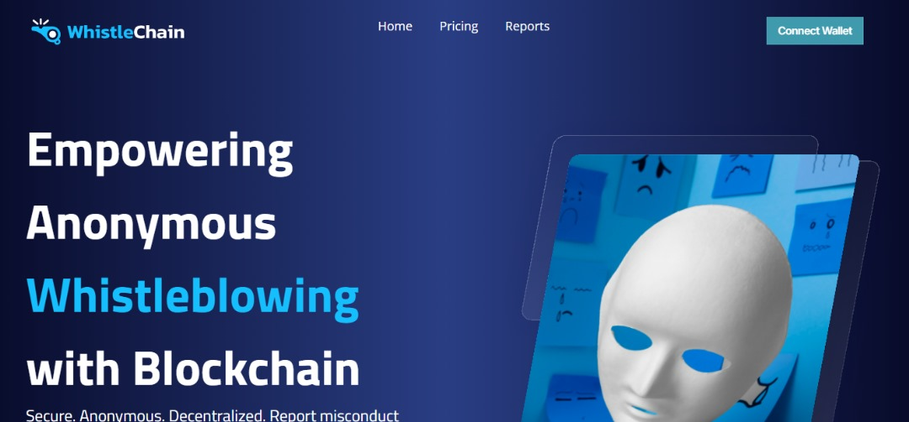
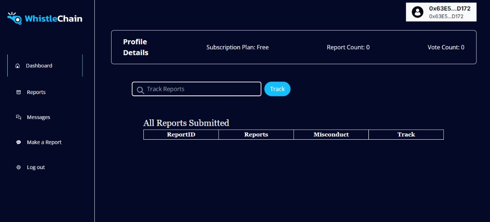

### WhistleChain A decentralized, anonymous, and secure blockchain-based whistleblowing platform where users can report misconduct and assist in investigations.


## Product Overview
Whistlechain is a blockchain-based whistleblowing platform that allows users to anonymously report misconduct. The reports are validated by a Decentralized Autonomous Organization (DAO), composed of platform users who vote (upvote or downvote) on the credibility of the whistleblown reports, and communicate directly with the anonymous whistleblower for further clarification via the in-app messaging system.


Whistlechain operates on a freemium and premium model. The freemium version allows users to submit one report per day and participate in three votes per day. The premium version offers unlimited reporting and voting access, which users can unlock through the purchase of tokens (WC Tokens).


The platform aims to empower individuals to report misconduct securely, ensuring transparency and integrity via decentralized validation, while maintaining user anonymity.

## Problem Statement
Whistleblowing is often impeded by fear of retaliation, lack of anonymity, and distrust in centralized authorities. Many whistleblowers hesitate to come forward due to potential risks to their personal safety or job security. Additionally, the validation of reports is usually managed by centralized bodies, which can lead to biased decisions and undermine trust in the process.
Whistlechain solves these challenges by:
1. Allowing anonymous reporting.
2. Ensuring the validity of reports through decentralized DAO voting.
3. Encouraging open communication between whistleblowers and validators through secure, anonymous chat.
4. Providing a decentralized, immutable record of reports on the blockchain.


## Goals and Objectives
1. Enable secure and anonymous whistleblowing.
2. Leverage blockchain to ensure transparency, immutability, and decentralized validation of reports.
3. Create a scalable freemium business model with token-based premium features.
4. Provide seamless user experiences for whistleblowers, validators, and organizations.
5. Encourage fair and community-driven decision-making via DAO through Upvoting and downvoting of reports
6. Messaging between whistleblowers and validators
7. Freemium and premium subscription models


## Target Audience: 
Whistlechain is primarily targeted at individuals who wish to report misconduct anonymously and organizations that seek to establish a transparent and ethical environment
Individuals seeking to report misconduct anonymously
Organizations looking to implement a transparent and secure whistleblowing system
DAO members interested in participating in the validation process

## User Roles:
* Whistleblower: Individuals who submit reports of misconduct.
* Validator/DAO User: Members of the decentralized community who review and validate reports.
Key Features
* Whistleblowing: Users can submit anonymous misconduct reports. Anonymity is ensured using blockchain wallet integration. A Report ID is generated upon submission for tracking purposes.
* Whistleblower Dashboard: Users can track the status of submitted reports using the report ID and view voting results and feedback in real-time.
* Anonymous Chat: Whistleblowers can receive messages from DAO users (validators) to clarify the report further.
* DAO User Validation: DAO users can view all submitted reports,  (can be filtered by severity, category, or submission date). DAO users (validators) are allowed to upvote or downvote a report.
* Consensus mechanism: reports are validated if they receive a predefined number of upvotes from different validators.
* Communication: Validators can initiate chats with whistleblowers to seek clarifications, request more information, or provide updates on the investigation status.
* Report Tracking & Updates from the whistleblower dashboard
* They can log in with their Report ID to track progress.
* Whistleblowers receive updates on the status of their reports (e.g., under review, validated, rejected) without revealing any personal information.
* Token-Based Access Model (WC Tokens)
Freemium users can upgrade to premium by purchasing platform tokens (WC tokens), unlocking unlimited whistleblowing and voting functionalities.

Tokens could be purchased and used for:
* Submitting additional reports.
* Participating in more votes beyond the daily limit.

* Immutable Blockchain Record
All reports and validations are permanently stored on the blockchain, ensuring that records cannot be tampered with or deleted, providing a reliable audit trail.
Decentralized Voting Mechanism

- 1


- 2



## Further Works
1. Dispute Resolution: In case of disagreements on reports or voting results, the whistleblower can raise a dispute through the decentralized dispute mechanism that allows validators to review and vote on the case again.
2. Dispute mechanism: If a whistleblower or validator disputes the report's outcome, the DAO can vote to reopen or resolve the case. (pend)
3. Incentives and Rewards
* Whistleblower Rewards: Whistleblowers can earn tokens when their reports lead to actionable results or when they are highly voted by DAO users.
* Validator Rewards: DAO validators can receive token-based rewards based on the accuracy of their validations and reputation points.
4. Reputation System for Validators
Validators receive a reputation points based on the quality of their decisions and feedback from whistleblowers.
5. Onboarding Company/Organization and it’s auditors
* Register organization and onboard internal auditors.
* Review reports submitted against the organization.
* Participate in report validation as part of the DAO.
* Allow organizations to create customized rules for voting and report validation.
6. Integration with Third-Party Auditors: Allow external auditors to access and validate public reports.
7. Mobile App Launch: Develop mobile applications for iOS and Android platforms.

## Conclusion
Whistlechain provides a secure, decentralized, and anonymous platform for whistleblowers while ensuring transparency and fairness through DAO-based validation. With its freemium and premium model, it aims to democratize access to whistleblowing and validation, empowering both whistleblowers and validators to participate in an equitable ecosystem.


## Additional Information
  
  ```bash 
Design:
 https://www.figma.com/design/IZcqEQ48KUvMsSMcoXDO9o/WhistleChain?node-id=0-1&node-type=canvas&t=UQJ2ixLoy95ePYnV-0 
 
 ``` 


```bash 
Repo:  
 https://github.com/pheobeayo/whistlechain-smart
 
 ``` 


 ```bash 
 PitchDeck:
 https://www.canva.com/design/DAGTZMxUC9U/efO0ZBcFvo_gar7of_LxkA/view?utm_content=DAGTZMxUC9U&utm_campaign=designshare&utm_medium=link&utm_source=editor 
 
 ```


 ```bash 
 Whistlechain deployed to emc: 0xF2837cD516f35686cBfD91B8A523abE6216DdE52 
 
 ```


```bash 
WhistleToken deployed to: 0x8d09d183A2d0D5a9cC91172a8568e0A1C27314ce

```


```bash
Demo Video:https://youtu.be/4OymI0MrVVU

```


```bash 
MVP:https://whistlechain-emc.vercel.app/ 

```